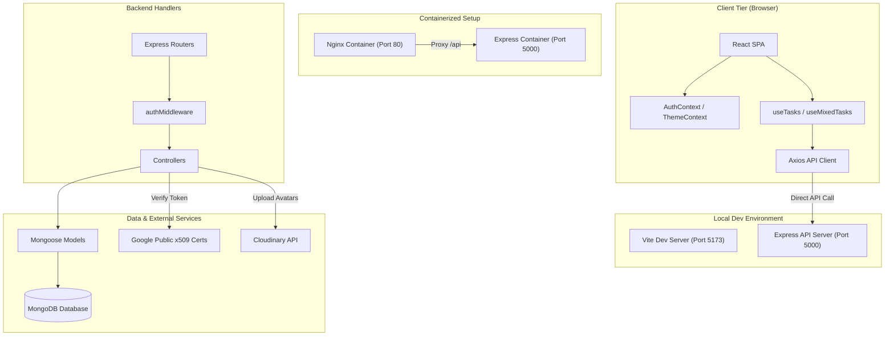
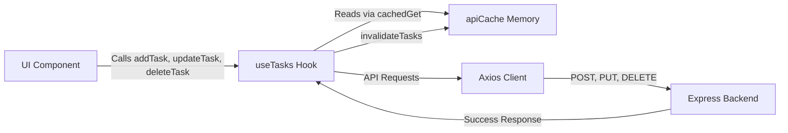
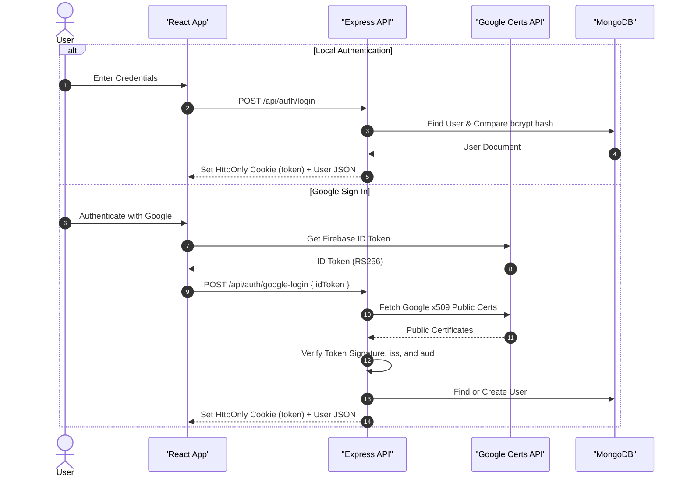
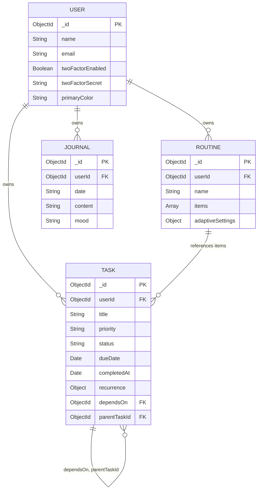
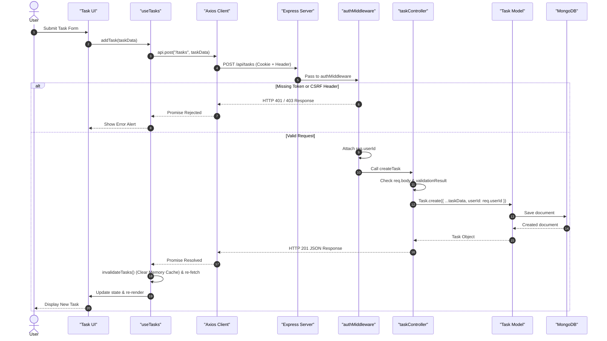
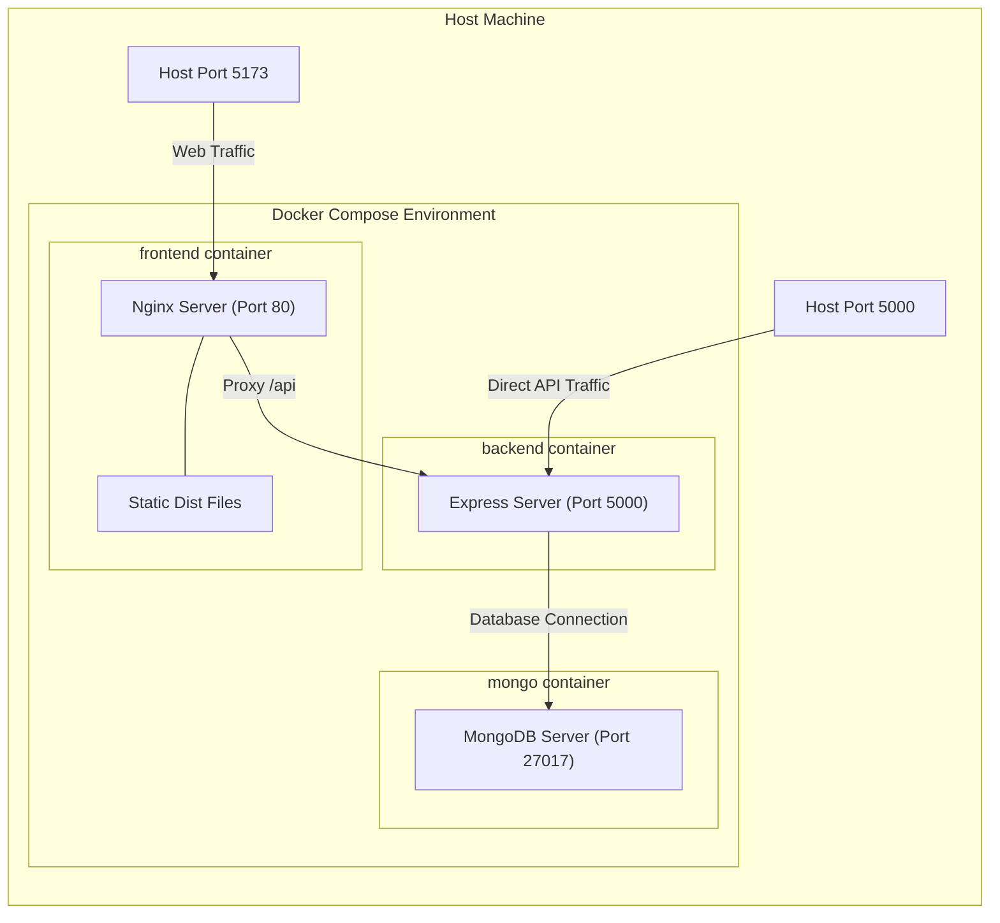

# DailyForge Architecture Guide

This document describes the software architecture, layer responsibilities, state abstractions, authentication mechanics, and deployment topology of **DailyForge**. It is intended to help maintainers and contributors understand how components interact and where new code belongs.

---

## Table of Contents

- [1. System Topology](#1-system-topology)
- [2. Project Structure and Responsibilities](#2-project-structure-and-responsibilities)
- [3. Frontend Architecture](#3-frontend-architecture)
  - [3.1 Routing and Access Control](#31-routing-and-access-control)
  - [3.2 State Management and Contexts](#32-state-management-and-contexts)
  - [3.3 API Client and Caching](#33-api-client-and-caching)
  - [3.4 Data Management Hook (`useTasks`)](#34-data-management-hook-usetasks)
- [4. Backend Architecture](#4-backend-architecture)
  - [4.1 Server Setup](#41-server-setup)
  - [4.2 Layer Responsibilities](#42-layer-responsibilities)
  - [4.3 Middleware and Security Checks](#43-middleware-and-security-checks)
- [5. Authentication and Security](#5-authentication-and-security)
  - [5.1 Session Restoration and JWT Cookies](#51-session-restoration-and-jwt-cookies)
  - [5.2 Google OAuth via Firebase](#52-google-oauth-via-firebase)
  - [5.3 Two-Factor Authentication and CSRF Header Check](#53-two-factor-authentication-and-csrf-header-check)
- [6. Data Models and User Scoping](#6-data-models-and-user-scoping)
  - [6.1 User Data Scoping](#61-user-data-scoping)
  - [6.2 Schema Overview](#62-schema-overview)
- [7. End-to-End Request Flow](#7-end-to-end-request-flow)
- [8. Deployment and Container Setup](#8-deployment-and-container-setup)

---

## 1. System Topology

DailyForge is structured as a client-server web application separating the frontend React single-page application from the backend Express REST API:



---

## 2. Project Structure and Responsibilities

Code is split into `frontend/` and `backend/` directories:

```text
DailyForge/
│
├── frontend/src/               # React Client Application
│   ├── api/                    # Shared Axios instance (axios.js)
│   ├── components/             # Reusable UI components (Dashboard/, Routine/, Task/)
│   ├── context/                # Context providers (AuthContext.jsx, ThemeContext.jsx)
│   ├── hooks/                  # Custom data & UI hooks (useTasks.js, useMixedTasks.js)
│   ├── pages/                  # Page route views (Dashboard.jsx, Tasks.jsx, RoutineBuilder.jsx)
│   ├── utils/                  # Utility functions (apiCache.js, heatmapUtils.js, dateUtils.js)
│   ├── App.jsx                 # Routes and protected route wrappers
│   └── main.jsx                # Application entry point
│
└── backend/                    # Express REST API Server
    ├── config/                 # Database (db.js) and Cloudinary (cloudinary.js) setup
    ├── controllers/            # Request handling, input validation, and DB queries
    ├── middlewares/            # Authentication, rate-limiting, and validation helpers
    ├── routes/                 # Endpoint path definitions matching controllers
    ├── src/
    │   ├── models/             # Mongoose schemas (User.js, Task.js, Routine.js, Journal.js)
    │   └── server.js           # Server startup, CORS, middleware, and error handler
    └── utils/                  # Server helpers (firebaseAuth.js, generateRecurringTasks.js)
```

### Observed Code Conventions
* **UI Views and Components**: Presentational elements belong in [`frontend/src/components/`](frontend/src/components/) or [`frontend/src/pages/`](frontend/src/pages/), registered as routes in [`frontend/src/App.jsx`](frontend/src/App.jsx).
* **State and API Handling**: Task collection state is managed by custom hooks such as [`frontend/src/hooks/useTasks.js`](frontend/src/hooks/useTasks.js), while page-specific operations (such as login or journal forms) call the shared Axios client ([`frontend/src/api/axios.js`](frontend/src/api/axios.js)) directly.
* **Backend Organization**: Route endpoints are defined in [`backend/routes/`](backend/routes/), request logic and validation in [`backend/controllers/`](backend/controllers/), and database schemas in [`backend/src/models/`](backend/src/models/).

---

## 3. Frontend Architecture

### 3.1 Routing and Access Control

Routing is configured in [`frontend/src/App.jsx`](frontend/src/App.jsx) using React Router DOM. Access control uses wrapper components:

* [`ProtectedRoutes.jsx`](frontend/src/components/ProtectedRoutes.jsx): Checks `AuthContext`. If session loading is in progress (`isLoading === true`), it renders a loading indicator. If `user` is null, it redirects unauthenticated visitors to `/login`.
* [`PublicRoute.jsx`](frontend/src/components/PublicRoute.jsx): Redirects authenticated users away from authentication views (`/login`, `/signup`).

### 3.2 State Management and Contexts

Global state is organized in React Context providers:

* [`AuthContext.jsx`](frontend/src/context/AuthContext.jsx): Manages the `user` state. It calls `/api/auth/me` on mount to restore existing sessions. It updates document styling when `user.primaryColor` changes and clears client state and memory cache during logout.
* [`ThemeContext.jsx`](frontend/src/context/ThemeContext.jsx): Toggles dark/light mode by setting the `dark` class on the root HTML element.

### 3.3 API Client and Caching

HTTP requests pass through a shared Axios client ([`frontend/src/api/axios.js`](frontend/src/api/axios.js)):

* `withCredentials: true`: Sends HttpOnly authentication cookies with requests.
* `headers["X-Requested-With"]: "XMLHttpRequest"`: Attached to satisfy backend CSRF checks on state-changing requests.
* **Timeout Interceptor**: Intercepts `ECONNABORTED` network errors (e.g., when a hosted server wakes from idle) and attaches a descriptive user message.
* **Memory Cache ([`frontend/src/utils/apiCache.js`](frontend/src/utils/apiCache.js))**: `cachedGet` stores `GET` responses in memory. Data mutations call `invalidateTasks()`, which purges cached responses for `/tasks` and `/analytics`.

### 3.4 Data Management Hook (`useTasks`)

The `useTasks` hook ([`frontend/src/hooks/useTasks.js`](frontend/src/hooks/useTasks.js)) encapsulates task retrieval, local pagination state, and CRUD operations:



#### Key Responsibilities
1. **State Ownership**: Holds `tasks` array, `loading` boolean, current `page`, and `pagination` metadata.
2. **Retrieval**: `getTasks` retrieves task pages using `cachedGet("/tasks", { params: { page, limit } })`.
3. **Task Mutations**:
   * `addTask`: Sends `POST /api/tasks`, invalidates memory cache, and re-fetches page 1 tasks.
   * `updateTask` & `deleteTask`: Optimistically update local `tasks` state before executing API calls. On error, the memory cache is invalidated and fresh state is re-fetched.
4. **Schedule Task Sync**: When updating tasks with temporary IDs starting with `"routine-"`, `updateTask` syncs changes with `localStorage` (`activeRoutineTasks`) and dispatches a `storage` event.
5. **Batch Updates (`bulkUpdate`)**: Processes array updates in concurrency-limited batches using `Promise.allSettled`.
6. **Cache Invalidation**: Calling `invalidateTasks()` purges cached responses for `/tasks` and `/analytics`.

---

## 4. Backend Architecture

### 4.1 Server Setup

The backend entry point ([`backend/src/server.js`](backend/src/server.js)) initializes Express, connects to MongoDB via Mongoose, configures Cloudinary, and sets up startup checks:

* **Environment Validation**: `validateEnv()` checks for `MONGO_URI` and `JWT_SECRET`, requiring `JWT_SECRET` to be at least 32 characters long to ensure signature security.
* **CORS Setup**: Parses allowed origins from `CORS_ORIGIN`, `CLIENT_ORIGIN`, and `FRONTEND_URL`, defaulting to `http://localhost:5173` for local development.

### 4.2 Layer Responsibilities

Backend code is organized across four main layers:

1. **Routes ([`backend/routes/`](backend/routes/))**: Map HTTP paths and methods to controller functions and attach route middlewares.
2. **Middlewares ([`backend/middlewares/`](backend/middlewares/))**: Intercept requests to perform authentication, rate limiting, and parameter validation.
3. **Controllers ([`backend/controllers/`](backend/controllers/))**: Handle business logic, input validation, database operations, and HTTP responses.
4. **Models ([`backend/src/models/`](backend/src/models/))**: Mongoose schemas defining document structures, data types, and indexes.

### 4.3 Middleware and Security Checks

* [`authMiddleware.js`](backend/middlewares/authMiddleware.js): Reads tokens from `req.cookies.token` or `Authorization: Bearer <token>`, verifies JWT signatures using `JWT_SECRET`, checks the `X-Requested-With` header on state-changing methods (`POST`, `PUT`, `DELETE`), and attaches `req.userId`.
* `express-rate-limit`: Restricts authentication endpoints (`/api/auth`) using `authLimiter`.
* [`validateObjectId.js`](backend/middlewares/validateObjectId.js): Validates MongoDB ObjectId route parameters before executing controller logic.
* [`asyncHandler.js`](backend/middlewares/asyncHandler.js): Catches unhandled promise rejections in controllers and passes them to Express error handling.

---

## 5. Authentication and Security

DailyForge supports local email/password login, Google OAuth via Firebase, and Two-Factor Authentication (2FA).



### 5.1 Session Restoration and JWT Cookies

1. **Login and Signup**: Users submit credentials to `/api/auth/login` or `/api/auth/signup`.
2. **Password Hashing**: Passwords are hashed with `bcrypt` before storage.
3. **Session Token**: On successful login, the server generates a JWT signed with `JWT_SECRET`.
4. **Cookie Storage**: The JWT is delivered in an HttpOnly cookie named `token` so client-side JavaScript cannot read it directly. Authorization Bearer headers are also supported as a fallback.
5. **Session Restore**: On page load, `AuthContext` calls `GET /api/auth/me`. `authMiddleware` validates the cookie token and returns the current user object.

### 5.2 Google OAuth via Firebase

1. The frontend authenticates users with Google using the Firebase Client SDK ([`frontend/src/utils/firebase.js`](frontend/src/utils/firebase.js)).
2. The client sends the resulting Firebase ID Token to `POST /api/auth/google-login`.
3. The backend ([`backend/utils/firebaseAuth.js`](backend/utils/firebaseAuth.js)) fetches Google's public x509 certificates, caches them according to HTTP `Cache-Control` headers, and verifies the token's RS256 signature.
4. The backend confirms that `iss` matches `https://securetoken.google.com/<FIREBASE_PROJECT_ID>` and `aud` matches `FIREBASE_PROJECT_ID`.
5. Once verified, the user is fetched or created in MongoDB, and an HttpOnly cookie session is issued.

### 5.3 Two-Factor Authentication and CSRF Header Check

* **2FA Encryption**: TOTP secrets generated via `speakeasy` are encrypted using AES-256-CBC (`TWO_FACTOR_ENCRYPTION_KEY`) before saving to MongoDB (`twoFactorSecret`), stored in `iv:encryptedHex` format.
* **Backup Codes**: Recovery codes are stored as `bcrypt` hashes (`backupCodes`).
* **CSRF Header Check**: `authMiddleware` verifies `X-Requested-With: XMLHttpRequest` headers on state-changing methods (`POST`, `PUT`, `DELETE`). Cross-origin browser forms cannot set custom headers without CORS preflight approval.

---

## 6. Data Models and User Scoping

### 6.1 User Data Scoping

DailyForge scopes user data at the database query level:
* User-owned schemas (`Task`, `Routine`, `Journal`) contain a `userId` field referencing the `User` document ID.
* `authMiddleware` populates `req.userId` from the verified session.
* Controllers include `{ userId: req.userId }` in database queries (for example, `Task.find({ userId: req.userId })`), ensuring users access only their own data.

### 6.2 Schema Overview



#### Schema Highlights
* **`User` ([`backend/src/models/User.js`](backend/src/models/User.js))**: Stores account details, encrypted 2FA secret, hashed backup codes, password reset tokens, and UI primary color customization.
* **`Task` ([`backend/src/models/Task.js`](backend/src/models/Task.js))**: Tracks tasks with priority (`Low`, `Medium`, `High`), status (`Due`, `In Progress`, `Completed`), completion timestamp (`completedAt`), recurrence rules (`daily`, `weekly`, `monthly`), and optional self-references (`dependsOn`, `parentTaskId`).
* **`Routine` ([`backend/src/models/Routine.js`](backend/src/models/Routine.js))**: Contains schedule items (`taskId`, `day`, `startTime`, `duration`) and `adaptiveSettings` for tracking burnout and consistency scores.
* **`Journal` ([`backend/src/models/Journal.js`](backend/src/models/Journal.js))**: Stores daily journal entries. A compound unique index on `{ userId: 1, date: 1 }` prevents duplicate entries for the same user on the same date.

---

## 7. End-to-End Request Flow

The diagram below traces an API request (adding a task) from UI interaction to database persistence and UI update:



### Error Handling
1. **Client Network Errors**: Axios interceptors capture `ECONNABORTED` errors and attach descriptive messages if the server is starting up.
2. **Async Handler**: Controller functions wrapped with `asyncHandler.js` catch rejected promises and forward errors to `next(err)`.
3. **Global Error Handler**: Express error middleware in [`backend/src/server.js`](backend/src/server.js) formats caught errors into JSON responses (`{ success: false, message: ... }`).

---

## 8. Deployment and Container Setup

DailyForge includes **Docker Compose** configurations for containerized setups:



### Container Configuration
* **Frontend ([`frontend/Dockerfile`](frontend/Dockerfile))**: Multi-stage build. The build stage compiles Vite static assets into `/app/dist`. The production stage uses `nginx:alpine` to serve static files on port 80 and uses [`frontend/nginx.conf`](frontend/nginx.conf) to proxy `/api` requests to `http://backend:5000`.
* **Backend ([`backend/Dockerfile`](backend/Dockerfile))**: Runs the Express API server on port 5000.
* **Docker Compose ([`docker-compose.yml`](docker-compose.yml))**: Connects `frontend`, `backend`, and `mongo` services with a volume (`mongo_data`) for database persistence.
